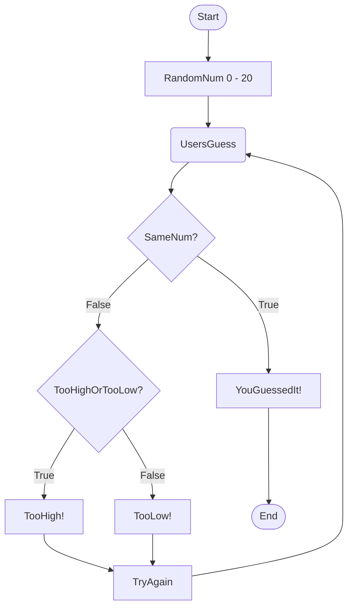

#### **Flowchart Description**

1. The computer generates a random numerical value from 0-20 and displays it.  
2. The user has to make a guess at the computer number.
3. If the user guesses the computer's number correctly it displays "YouGuessedIt!" and the program will end.
4. If the user guesses incorrectly it will display whether or not the user's guess was too high or too low, display "TryAgain!", and will then return the user to "UsersGuess" for them to attempt another guess.  
5. Once the user is prompted to make another guess the program will start from "UsersGuess".
