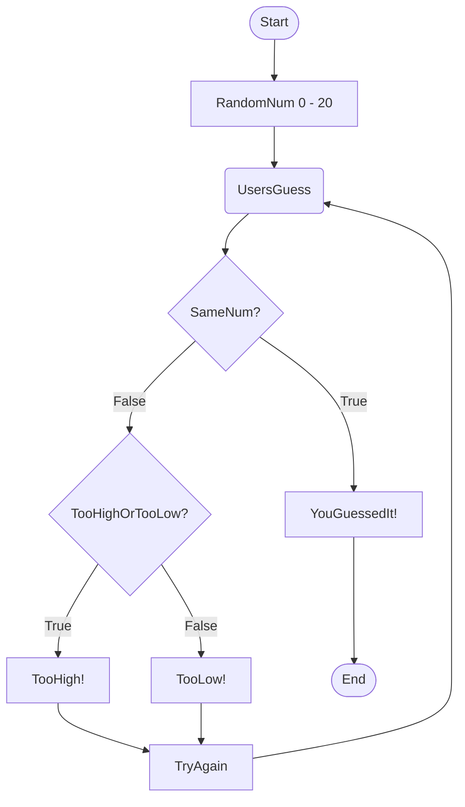

Hello, I'm Montrae and I cant't wait to work with all of you!

## **ABOUT ME**

* My name is Montrae  
* My favorit color is blue  
* I am currently a junior in high school  
* There was a coding class I took in middle school that got me interested in coding  

### **My Interest**

1. I love to sleep and take naps.  
2. I like to read things that interest me.  
3. I enjoy playing video games.
     
### **Websites I Recommend**

- [FreeCodeCamp](https://www.freecodecamp.org/) - Someone in my class had recommended me this websight for learning different programing languages for free.  
- [Healthline](https://www.healthline.com/m) - Healthline contains a bunch of health related articles.  

#### **Flowchart Description**

1. The computer generates a random numerical value from 0-20 and displays it.  
2. The user has to make a guess at the computers number.
3. If the user guesses the computers number correctly it displays "YouGuessedIt!" and the program will end.
4. If the user guesses incorecctly it will display weather or not the ussers guess was too high or too low, display "TryAgain!", and will then return the user to "UsersGuess" for them to attempt another guess.  
5. Once the user is prompted to make another guess the program will start from "UsersGuess".
